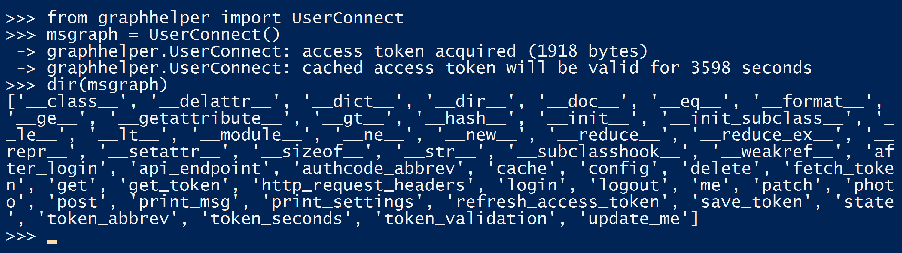

# graph-library-poc

This repo contains the code for an experimental project at Microsoft's internal
One Week hackathon. The goal was to create a simple Python helper library for
working with Microsoft Graph.

Only a few helpers are currently defined, and the features, naming, and roadmap
are all TBD. This is just an investigation of some ideas, and the code is provided
here for anyone who may find it useful or educational.

If you have suggestions or ideas about how you'd like to work with Microsoft Graph
from Python code, I'm very interested in your thoughts! Please post issues on this
repo, or email me at *dmahugh* at that big company in Redmond, WA. :)

# Installation

The current version requires Python 3.5 or above (from [here](https://www.python.org/)), and the Requests library (```pip install requests```). I've been
using Requests 2.18.1, but any recent version should be fine.

You'll need to register an application at the [Application Registration Portal](https://apps.dev.microsoft.com), where
you can obtain the information that needs to be entered into the userconnect.json template. Then put your filled-in JSON file in a ```config``` folder under the main folder of your cloned repo, and you should be ready to go.

# Usage

The first thing to try after you've installed and configured the library as described above is to run the ```webapp.py``` sample and then navigate a browser to http://localhost:5000. Click the Connect button to authenticate, and you should see your most recent 10 email messages. That confirms your configuration is correct.

After running the web app, you can run the samples in ```samples.py```. Note that there are several samples, and there's a one-liner calling each of them at the bottom of that file. You can comment out all of them except a single sample to experiment with one thing at a time.

# Documentation

There is no documentation yet, but you can get a feel for some of the capabilities of
the graphhelper module by reading and running the code in ```samples.py```.

The graphhelper package is implemented in three source files:

* *connect.py* contains the class definitions for the GraphConnection abstract base class and the UserConnect and AppConnect classes that derive from it.
* *userhelpers.py* contains helper functions and classes for UserConnect applications – i.e., applications that get their Graph access tokens through an authenticated user identity.
* *apphelpers.py* contains helper functions and classes for AppConnect applications, which use app-only authentication via the OAuth 2.0 Client Credentials workflow.

After you've run the ```webapp.py``` sample app and authenticated, you'll have a cached token to work with. You should then be able to import graphhelper:


 